# Flows

End-to-end diagrams for the major paths through AI Note Taker. Each section
names the real files and functions involved, so a diagram can be traced
straight into the code.

- [1. System overview](#1-system-overview)
- [2. Data model](#2-data-model)
- [3. Live recording → notes](#3-live-recording--notes)
- [4. Recording lifecycle (state machine)](#4-recording-lifecycle-state-machine)
- [5. Recording survives navigation](#5-recording-survives-navigation)
- [6. Draft autosave & crash recovery](#6-draft-autosave--crash-recovery)
- [7. File upload → notes](#7-file-upload--notes)
- [8. Typed message → notes](#8-typed-message--notes)
- [9. User profile → personalized notes](#9-user-profile--personalized-notes)
- [10. Routing: whether to touch the notes at all](#10-routing-whether-to-touch-the-notes-at-all)
- [11. Conversation creation & cleanup](#11-conversation-creation--cleanup)
- [12. Rendering the notes document](#12-rendering-the-notes-document)

---

## 1. System overview

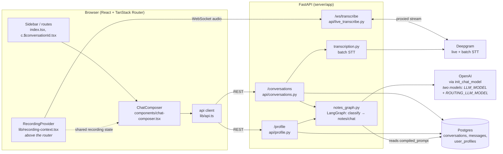

The Deepgram API key never reaches the browser — `/ws/transcribe` proxies the
live stream server-side (`live_transcribe.py`).

---

## 2. Data model

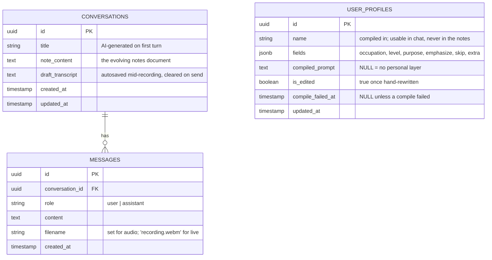

`USER_PROFILES` is intentionally unrelated to conversations — it applies
globally (no auth/per-user scoping in this build) and is effectively a
single row: saving replaces the previous value.

`compiled_prompt` is the *only* prompt text in the database. Everything
else the model is told lives as plain constants in
`services/notes_graph.py`, versioned with the code that reads it. That
column is the exception: it is written by an LLM at runtime from user
input, so the code can't hold it.

---

## 3. Live recording → notes

The main path. Note the two separate audio journeys: chunks stream to
Deepgram live for the on-screen transcript, **and** accumulate into a blob
that's uploaded on send.

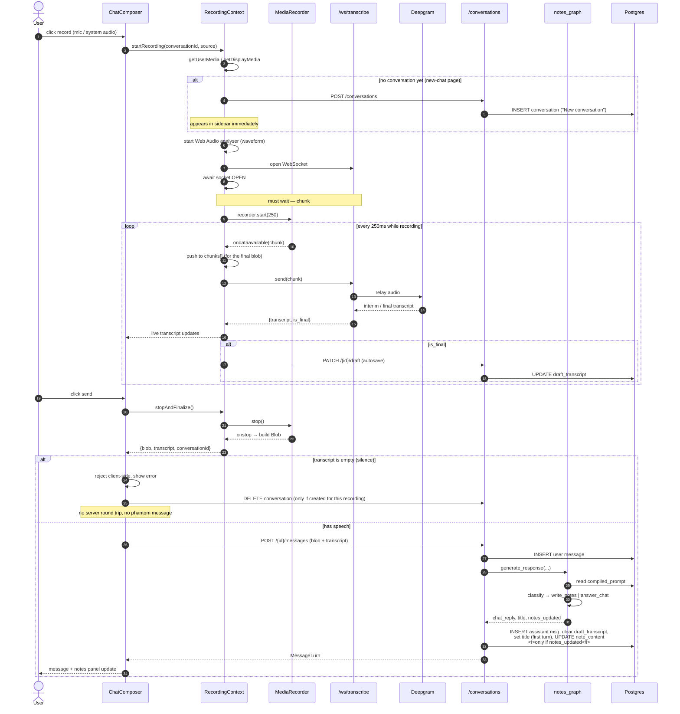

Because the transcript is captured live, the send path passes it along and
the server **skips** a redundant batch transcription (`send_message` only
calls `transcribe_audio` when `transcript is None`).

---

## 4. Recording lifecycle (state machine)

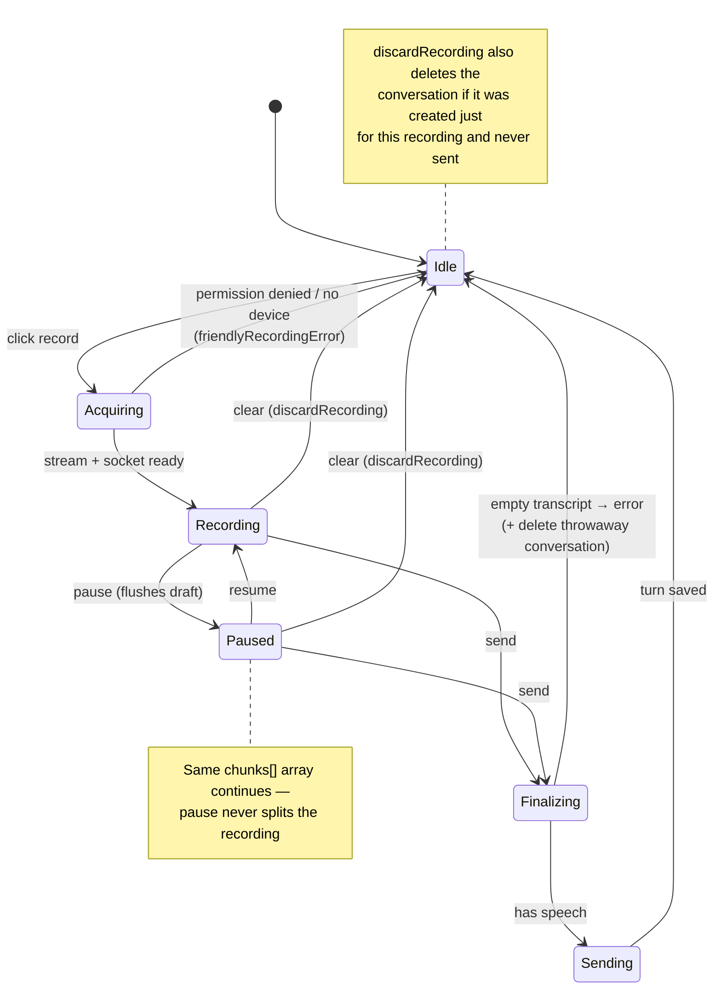

---

## 5. Recording survives navigation

The engine lives in `RecordingProvider` at the **app root, above
`<Outlet />`** — so switching routes never unmounts it. Only the *view*
changes.

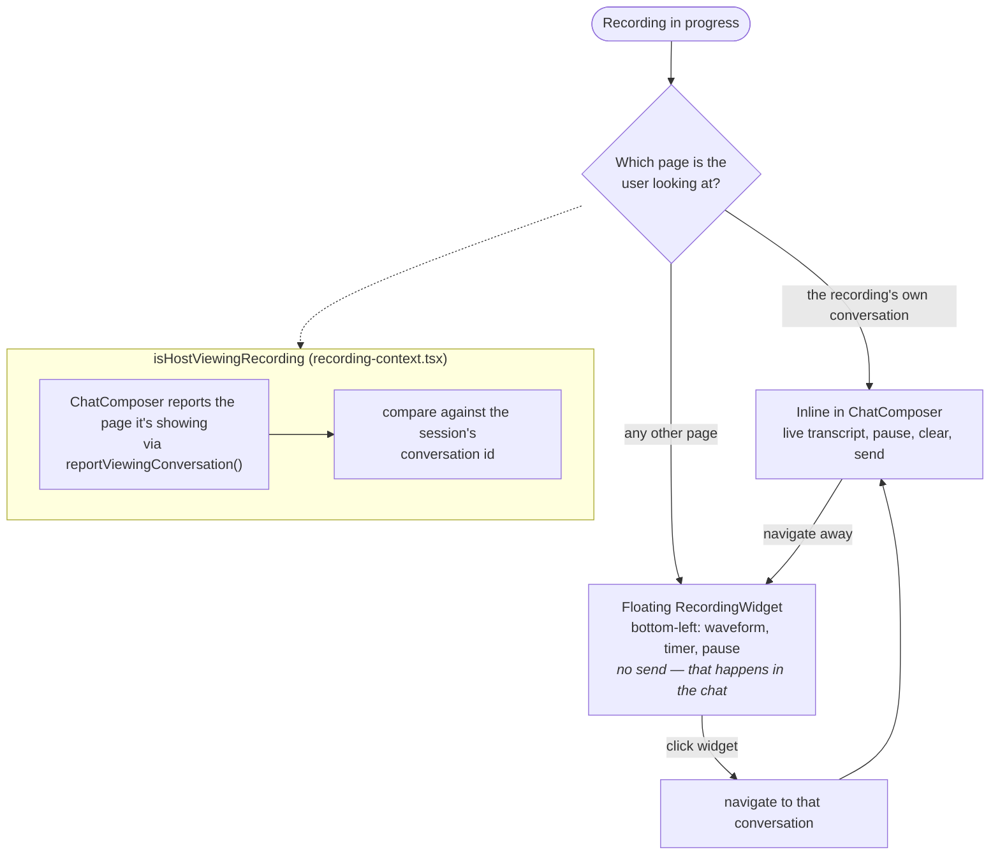

`nullHostRetired` handles one edge case: a recording started on `/` must not
re-attach itself to `/` later (clicking "New chat" after visiting another
conversation) — otherwise a fresh new-chat page would resurrect the old
recording's transcript.

---

## 6. Draft autosave & crash recovery

Protects a long recording from being lost before the user ever hits send.

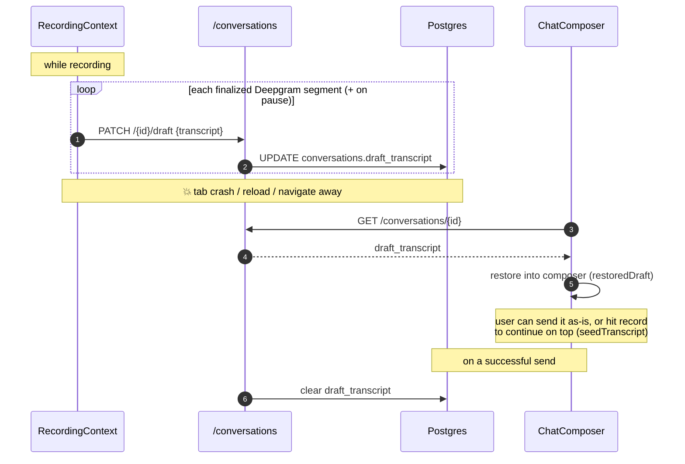

Guards worth knowing (both exist because a late Deepgram result could
otherwise resurrect text that was deliberately discarded):

- `allowDraftSaveRef` — flipped off the moment a send or discard begins.
- `ws.onmessage = null` before closing the socket, since `close()` doesn't
  cancel a message already in flight.

---

## 7. File upload → notes

No live transcript exists, so the **server** transcribes via Deepgram's batch
REST API.

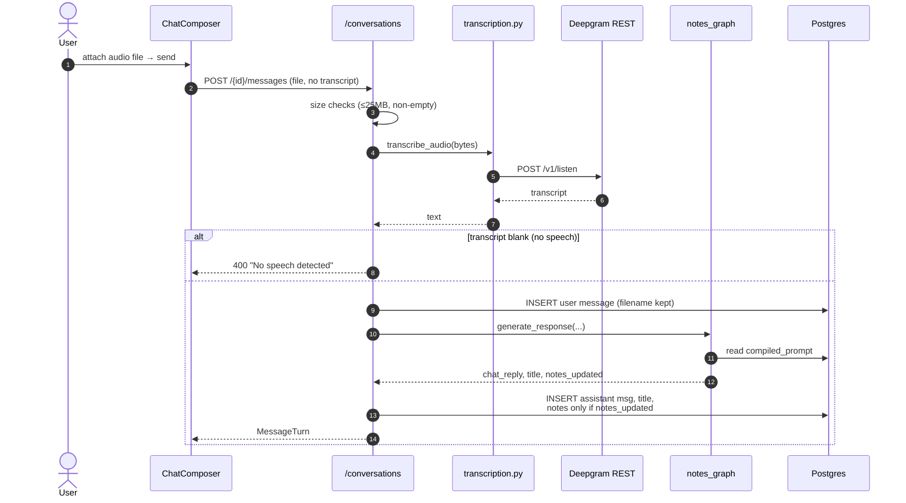

In the chat, an uploaded file renders as a **file chip** (filename + expand
chevron) rather than raw transcript text — `isFileAttachment()` in
`message-bubble.tsx` distinguishes a real upload from a live recording by
checking the filename isn't `recording.webm`.

---

## 8. Typed message → notes

The shortest path — no audio anywhere.

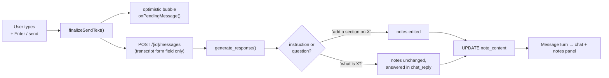

---

## 9. User profile → personalized notes

A short form, compiled by an LLM into a few sentences **describing the
user** from their answers. That text rides along on every note/chat
prompt as context — `compiled_prompt` is pasted into the system prompt
verbatim, never re-interpreted. The compiler does not invent note-writing
strategy; it only restates who the user is and what they said.

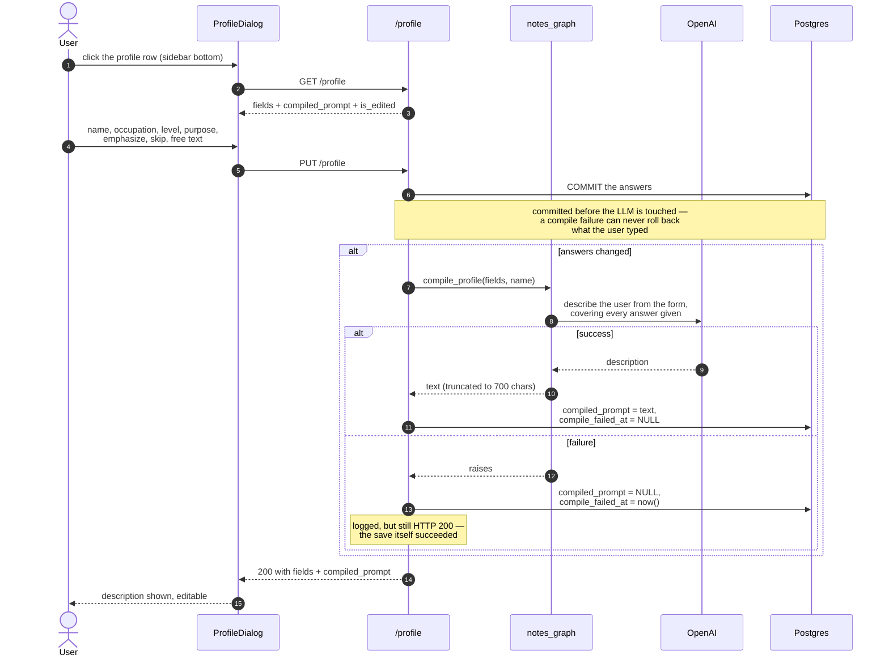

Compilation runs **inside** the request and returns with it, so the response
is complete: no polling, and nothing appears later out of nowhere. It only
runs when an answer actually changed, so re-saving an untouched form costs
nothing (measured: 46ms vs ~1.5s).

### Three states, told apart by two columns

`compiled_prompt` alone is ambiguous — null could mean "never filled in" or
"we tried and it broke". `compile_failed_at` is what separates them.

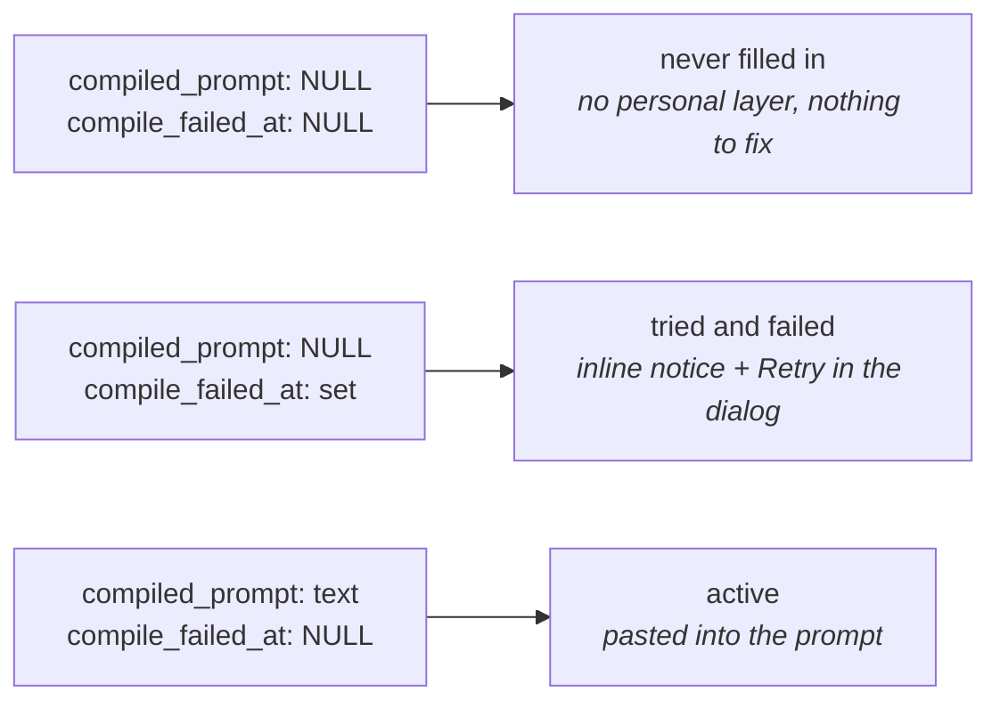

### Lazy retry

If a note job runs while the profile has answers but no compiled text, an
earlier compile failed. It tries once more, then gets out of the way.

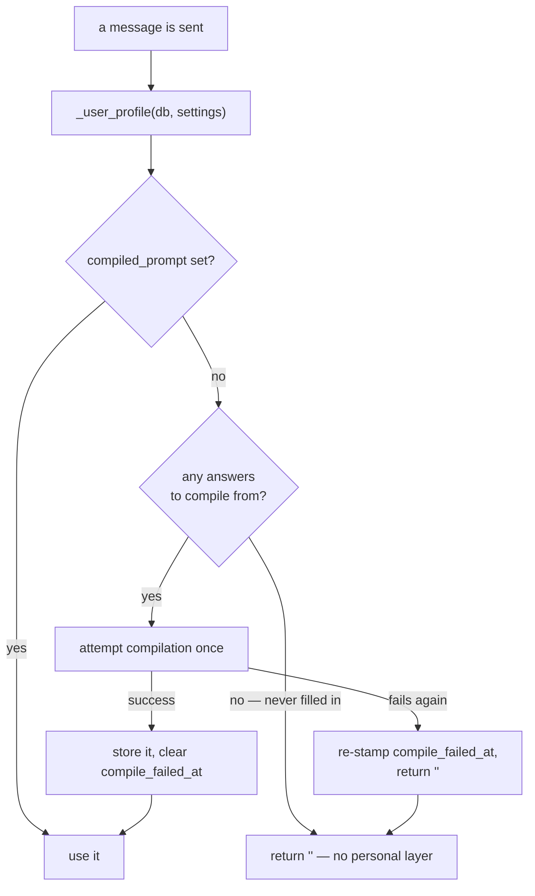

The rule that governs all of it: **notes without personalization are fine;
notes that fail to generate are not.** A compile failure never raises into
the note job, and `_build_notes_prompt` simply omits the block when the
string is empty — no special casing anywhere else.

### Protecting a hand-edited prompt

The compiled text is shown in an editable textarea, because an invisible
profile feels like it does nothing. Editing it sets `is_edited`, after which
the app won't silently overwrite your wording.

| Action | Result |
|---|---|
| Save, never hand-edited | Recompiles if any answer changed |
| Save, after hand-editing | Asks first — **Keep mine** saves the answers but skips the recompile |
| Regenerate | Always recompiles, no confirmation |
| Editing the textarea | Saves on blur, marks `is_edited` |

Two subtleties worth knowing. `name` is a column of its own rather than part
of `fields`, so change detection compares **both** — otherwise renaming
yourself would save but leave the old name baked into the description.
And Save waits on any in-flight blur-save before reading `is_edited`, since
clicking Save straight out of the textarea fires both at once.

## 10. Routing: whether to touch the notes at all

Each turn runs a two-step LangGraph: a router decides *whether* the notes
should change, and only then does a second call write them.

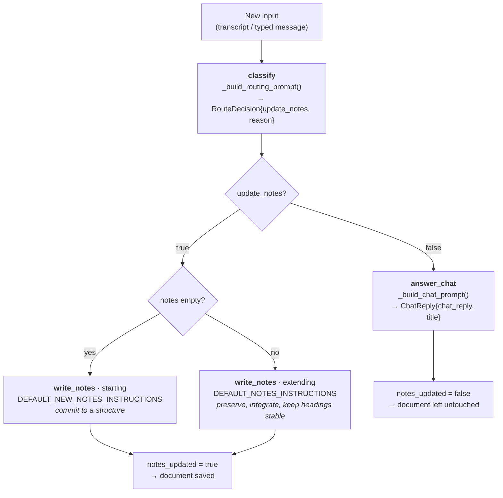

Both note branches share one set of writing rules (`_NOTES_WRITING_RULES`);
only the framing differs. Starting a document wants commitment to a
structure, while extending one is dominated by preservation rules that are
noise on a blank page — and its "keep existing headings stable" guidance
actively discourages committing to any.

**Why two calls instead of one.** The router's schema (`RouteDecision`) has
no `note_content` field, so it *cannot* write notes even if the model wants
to. A single call given a "return the full updated document" contract will
essentially always return one — which is how filler like `.` or `thanks`
used to rewrite the notes.

The router says **no** when there isn't enough substance to build notes
from, when the input is a question meant for the chat, or when substantive
content belongs to a genuinely different domain (it offers in chat instead
of silently grafting it on). Relatedness is judged at the level of the
*course*, not the subtopic — a lecture constantly introduces new material,
so a new chapter or definition is still related. Explicit instructions —
*"add a section on X"* — always win, so changing topic on purpose works.

The prompts also tell the model its input is **ASR output**: expect missing
punctuation, false starts, and misheard technical terms, and read through
those artifacts rather than treating them as content. Unresolvable terms get
marked `[?]` in the document.

`conversations.py` only persists notes when `notes_updated` is true, and
always returns the *stored* document, so a chat-only turn can't blank the
notes panel client-side.

### What each prompt is built from

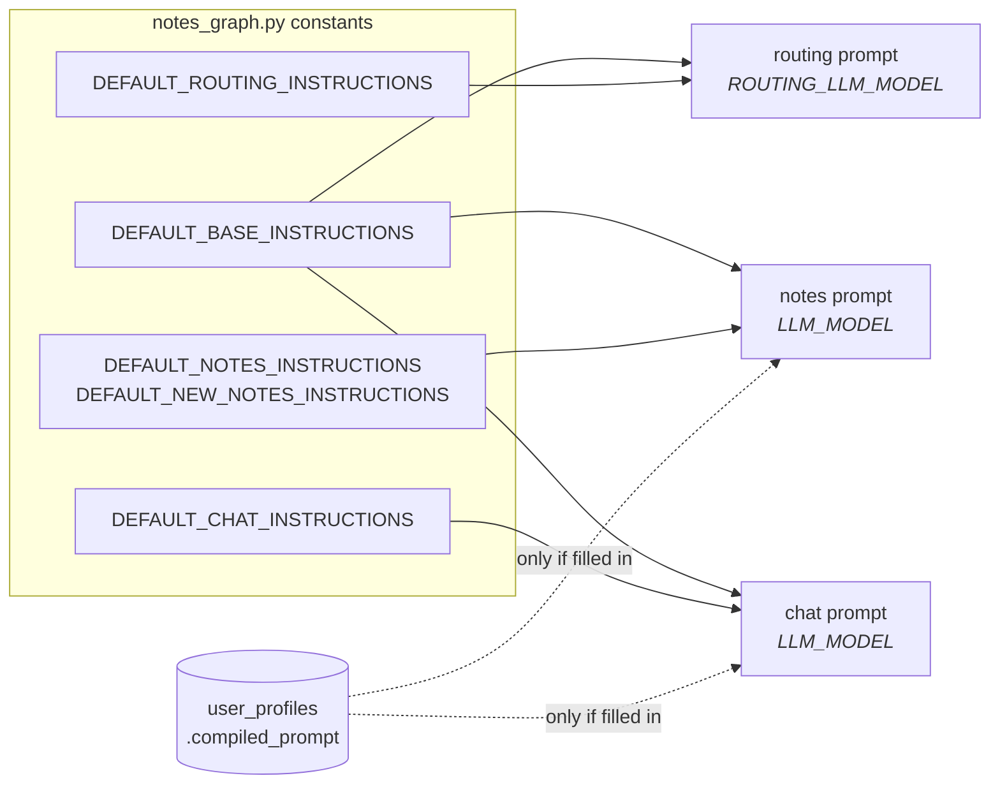

Note which arrows are missing. The **router** gets no personalization at all
— whether an input deserves a note change has nothing to do with who the
user is. The **profile** reaches notes *and* chat, because an explanation
pitched at the wrong level is unhelpful whichever branch produced it.

The router also runs on its own model (`ROUTING_LLM_MODEL`, resolved
separately in `_resolve_llm`). It answers a yes/no question against a small
schema, so it doesn't need the model that writes the notes — and keeping it
cheap means the per-turn cost of *refusing* to write notes stays near zero.

That containment is what makes personalization safe: user-supplied content
can never reach the output contracts the code depends on.

---

## 11. Conversation creation & cleanup

A conversation is created **eagerly** (the moment recording starts) so the
transcript has somewhere to persist — which means the throwaway cases need
explicit cleanup.

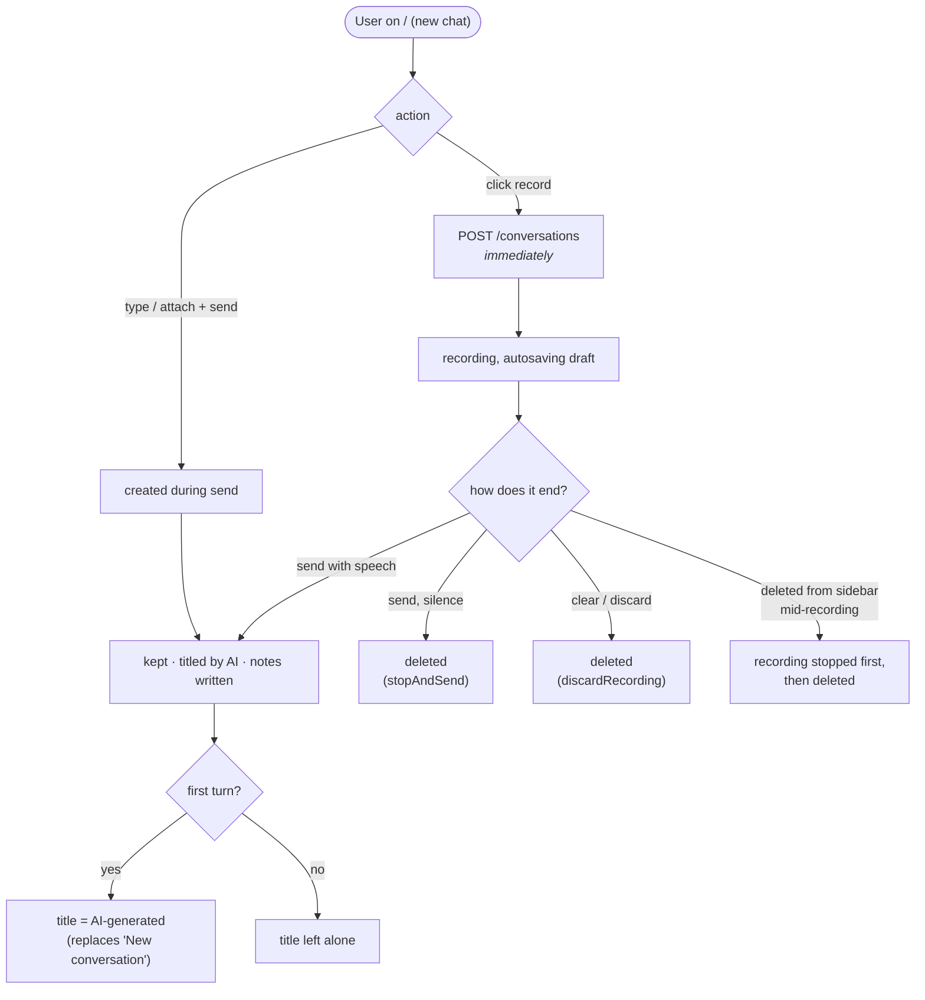

Every delete path also stops any recording attached to that conversation
first — otherwise its autosaves would 404 in a loop and the floating widget
would point at a conversation that no longer exists.

---

## 12. Rendering the notes document

`note_content` is Markdown written by a model, which makes it *untrusted*
input as far as the browser is concerned. One shared `<Markdown>` component
(`components/markdown.tsx`) renders both the notes panel and assistant chat
messages, so the two can't drift apart.

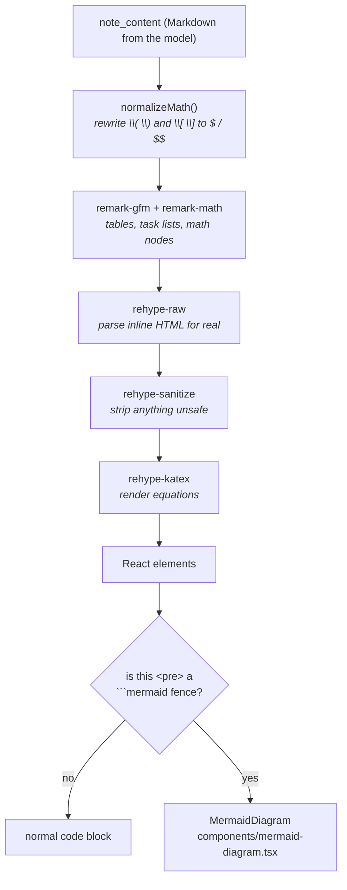

Two orderings in there are load-bearing:

- **raw → sanitize → katex.** `rehype-raw` has to parse the model's HTML
  before `rehype-sanitize` can clean it. KaTeX runs *last* because it injects
  its own classed markup, and the sanitize schema doesn't allow `className` —
  running it earlier would strip every rendered equation.
- **`pre`, not `code`.** The mermaid fence is intercepted on the `<pre>`
  element. Returning a `
` from the `code` component would nest flow
  content inside an element that only accepts phrasing content.

### Diagrams

Mermaid is imported **dynamically** — it's the largest dependency in the app
and most notes contain none, so it stays out of the main bundle. Diagram
source is model-generated and therefore often malformed, so `parse()` runs
before `render()` and every failure falls back to showing the source as an
ordinary code block. A broken diagram must never blank a set of notes the
user just recorded an hour of lecture for.

On the server, `_DIAGRAM_RULES` is its own section of the notes prompt rather
than a bullet among the writing rules. Position alone made no measurable
difference; what moved the model was making the trigger an **imperative**.
Drawing a diagram is discretionary, and a small model resolves discretion
toward doing less — so the four shapes that warrant one (ordered process,
state machine, message exchange, branching decision) are named as a
requirement, along with which diagram type each maps to and the arrow syntax
that belongs to it.
